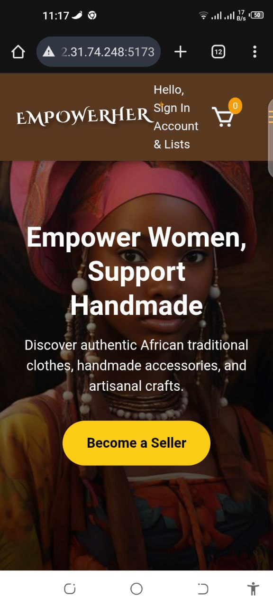
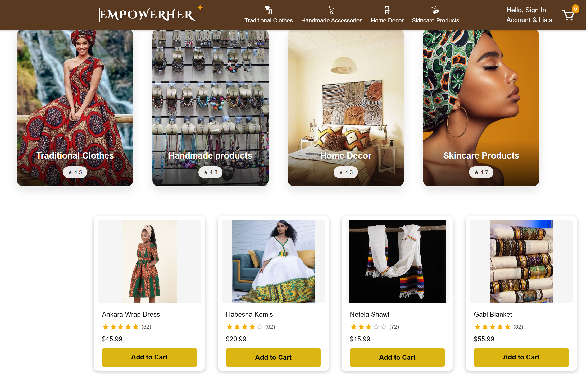
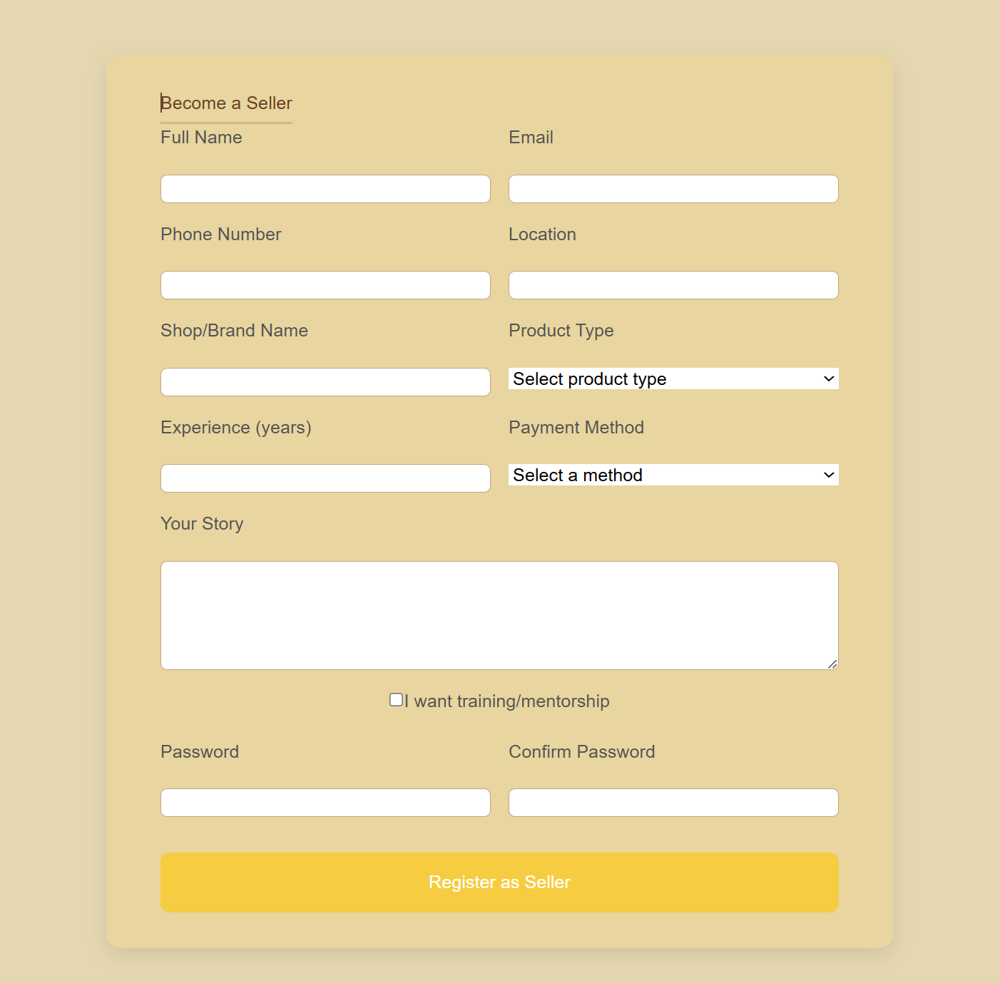

# EmpowerHer – Marketplace for African Handmade Products 🌍🧵

**Empower Women, Support Handmade**

EmpowerHer is a full-stack web application built to empower African women artisans by giving them a digital platform to showcase and sell handmade products — including clothing, accessories, skincare items, and home decor.

The platform includes seller registration, user authentication, and an admin dashboard. Designed to promote cultural heritage and economic independence.

---

## 🎥 Hero Carousel Demo

https://github.com/Hikma-Ahmed7040/EmpowerHer/blob/main/Demo/herovid.mp4
*🎞️ This short video showcases the smooth hero section carousel effect.*

---

## 📱 Responsive Mobile View

  

*The site is fully responsive across phones, tablets, and desktop.*

---

## 📸 Screenshot Previews

| Landing Page | Seller Registration | Admin Dashboard |
|--------------|---------------------|-----------------|
|  |  |  |

> 💡 Tip: YOu can find this image in a `Demo/` folder in this repository.

---

## 🔧 Tech Stack

### 🌐 Frontend
- **React.js** (with Vite)
- **Tailwind CSS** for utility-first styling
- Fully **responsive** design for all screen sizes

### 🔐 Backend & Auth
- **Firebase Authentication** for secure login/signup
- **Firebase Firestore** for real-time database
- Admin dashboard for managing listings

---

## 🚀 Features

- 🛍️ Seller registration and product listings
- 🧑‍💼 Admin dashboard to monitor activity
- 🔒 User authentication using Firebase
- 🪄 Animated hero carousel with smooth transitions
- 📱 Mobile-first responsive UI
- 🌍 Focus on promoting local women-led businesses

---

## 🤝 Acknowledgment

Originally developed for the **Technovation Girls Challenge** as a solo project with mentor guidance.

Although the team didn’t qualify internationally, this project showcases passion, fast learning, and real-world problem solving with modern full-stack tools.

---

## 📂 Folder Structure

